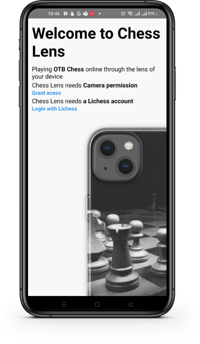
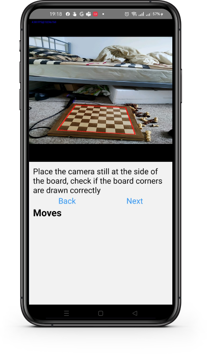

# ChessLens
Over the board chess but online with computer vision

  

  

## Goals
The goal of this project is not to invent a new algorithm/model to detect chess pieces and board positions But rather to leverage,combine and improve on the existing algorithms and APIs to create
an end-user application
## How it works
User logs in to their account and select game mode like they would on Lichess.  
Put your phone at a steady angle to the board where it can see the whole board clearly  
If its your turn, play the move on the board, otherwise, wait for opponent's move, this will be announced via a text-to-speech subsystem  
